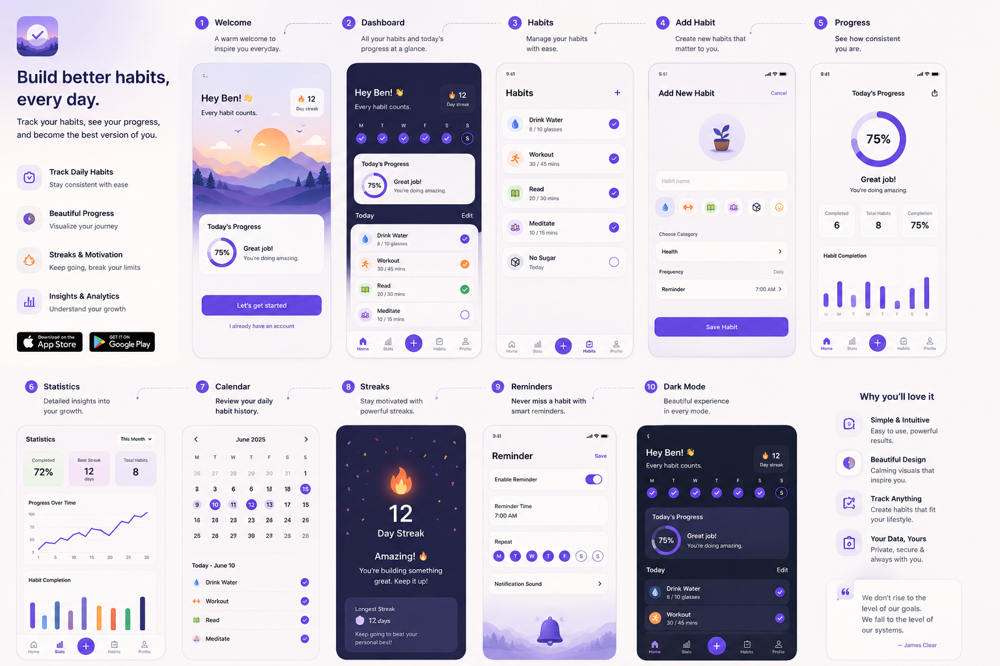

<div align="center">

# 🌱 Habbity

### Build better habits. Every day.

A beautifully crafted habit tracker designed to help you build consistency through simple routines, meaningful insights, and delightful interactions.

<p>

</p>


</div>

---

## ✨ Features

- 📊 Beautiful Dashboard
- ✅ Daily Habit Tracking
- 🔥 Streak System
- 📅 Calendar History
- 📈 Statistics & Insights
- ⏰ Smart Reminders
- 🌙 Dark Mode
- 🎨 Modern & Minimal UI
- 💾 Offline-first with AsyncStorage

---

## 📱 Screens

- Welcome
- Dashboard
- Habits
- Add Habit
- Progress
- Statistics
- Calendar
- Streaks
- Reminders
- Dark Mode

---

## 🎨 Design

The interface is inspired by calm, minimal productivity apps with an emphasis on motivation rather than pressure.

**Design principles**

- Clean & Minimal
- Soft Purple Theme
- Large Rounded Cards
- Positive Reinforcement
- Smooth Animations
- Accessible Interactions

The application aims to closely match the design reference in **`docs/design.png`**. :contentReference[oaicite:0]{index=0}

---

## 🛠 Tech Stack

### Mobile

- React Native
- Expo SDK 57
- TypeScript

### Storage

- AsyncStorage

### Notifications

- Expo Notifications

### Styling

- React Native
- Expo Vector Icons

---

## 🚀 Getting Started

```bash
git clone https://github.com/<username>/habbity.git

cd habbity

npm install

npm start
```

Run on Android

```bash
npm run android
```

For APK/AAB builds using Expo EAS, refer to **ANDROID.md**. :contentReference[oaicite:1]{index=1}

---

## 📂 Project Structure

```
src
├── components
├── constants
├── hooks
├── logic
├── notifications
├── screens
├── storage
├── styles
├── types
└── utils
```

---

## 📍 Roadmap

- [x] Habit Management
- [x] Dashboard
- [x] Statistics
- [x] Calendar
- [x] Reminder Scheduling
- [x] Dark Mode
- [ ] Habit Editing Improvements
- [ ] Better Animations
- [ ] Widgets
- [ ] Cloud Sync
- [ ] AI Habit Coach

The implementation roadmap and architecture decisions are documented in **DEV_PLAN.md**. :contentReference[oaicite:2]{index=2}

---

## 📖 Documentation

| Document | Description |
|----------|-------------|
| `overview.md` | Product vision & design documentation |
| `DEV_PLAN.md` | Development roadmap & architecture |
| `ANDROID.md` | Android build & deployment guide |
| `PRIVACY_POLICY.md` | Privacy policy for Habitty and Play Console listing |

---

## 🤝 Contributing

Contributions, ideas, and feedback are always welcome.

```bash
fork 🍴
↓
create feature branch 🌿
↓
commit changes ✅
↓
open pull request 🚀
```

---

## 📜 License

MIT License

---

<div align="center">

### 🌱 Build better habits, one day at a time.

Designed & Developed by **Benjamin G Nechicattu**

</div>
